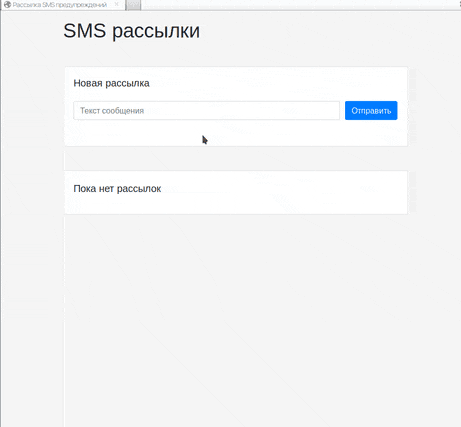

# MCHS - Sending SMS messages 

SMS service using SMSc.ru API, Redis, Quart, and Trio.

This is a demo, not a working product. 

Delivery statuses and db optimization will be implemented later during lesson 9.



## Requirements

* Python 3.8+
* [Poetry](https://github.com/python-poetry/poetry) for managing dependencies.

If you don't want to use poetry for some reason - you can use `virtualenv`. Just check `pyproject.toml` to see which python packages you need to install.

## How to install

* `poetry install` will create virtualenv and install all dependencies.
* `poetry shell` will activate virtualenv

## How to run

Run 
```commandline
python server.py
```

The server will listen on `http://127.0.0.1:5000`


**Settings for `server.py`**

You can either declare settings as environment variables or inside `.env` file in `config` directory

```bash
cp config/.env.template config/.env
nano config/.env
```

| Environment variable |  Description  |
|---|---|
| SMSC_LOGIN  | Username on smsc.ru website  |
| SMSC_PASSWORD  |  Password on smsmc.ru website |
| SMSC_USE_MOCK | (True or False) - If True then calls to smsc.ru API will be mocked. No real requests will be send  |
| REDIS_URI | Redis server URI (for example redis://127.0.0.1:6379) |
| REDIS_PASSWORD  | Redis password if there is any |


## Project Goals

The code is written for educational purposes to solve the task from [Devman](https://dvmn.org).
